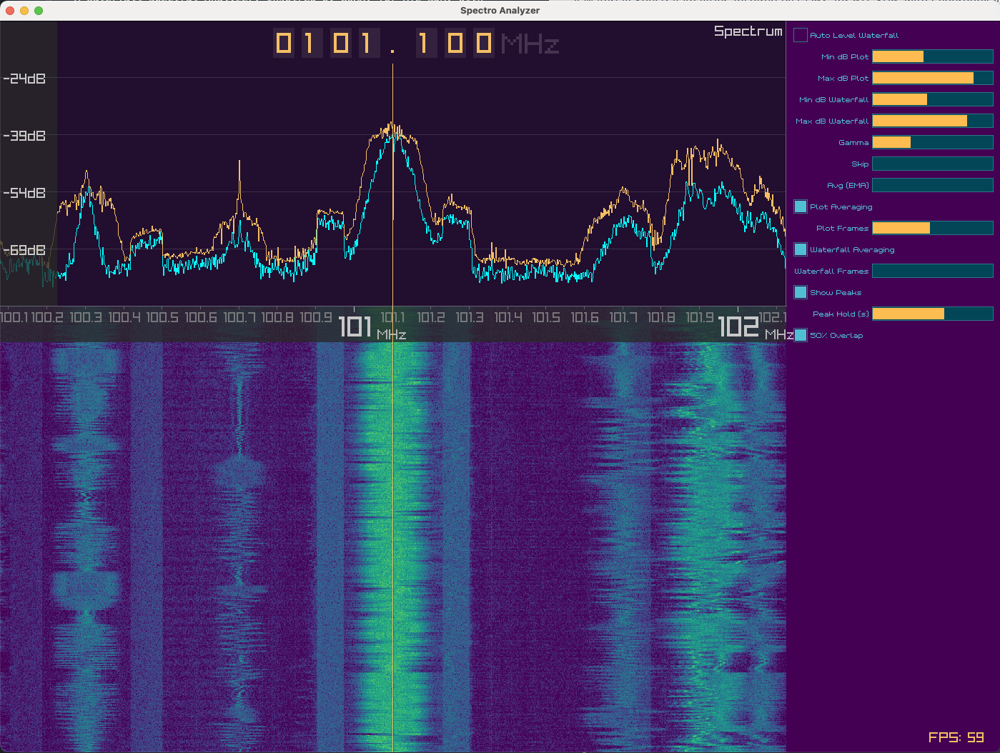

## Spectro - A Fun Little SDR Spectral Analyzer

A Pretty Waterfall Spectral Analyzer, for RTL-SDR (and more to come), Inspired by GQRX, with Cyberpunk Vibes, written in Odin and Raylib.




### Why?
1. I wanted to learn Odin and build something useful with it.
2. I work in RF/telecom and wanted a simple, focused waterfall display that just works, nothing too fancy.
3. I like Raylib becayse it makes things easy.
4. I like pretty, graphical things.
5. The SDR community could use another general-purpose waterfall open-source spectrum analuzer with some style.

### Building
- Requirements:
  - Odin compiler `brew install odin`
  - librtlsdr `brew install librtlsdr` on macOS or `apt install librtlsdr-dev` on Linux
 
Clone the repo and initialize submodules:
```bash
git clone https://github.com/grplyler/spectro.git
cd spectro
git submodule update --init --recursive
./b # or odin build spectro -o:speed -out:build/spectro
```

Build Script:
```bash
odin build spectro -o:speed -out:build/spectro
```

### Running
`./r` or `./build/spectro` to run the application.

### Key Features Implemented:
- [x] **RTL-SDR Integration**: Continuous sample acquisition from RTL-SDR device
- [x] **GPU Accelerated**: Efficient scrolling effect using fragment shader and ring buffers
- [x] **Click to Tune**: Click on the waterfall to retune the SDR to the clicked frequency 
- [x] **Peak Visualization**: With variable hold time
- [x] **FFT Processing**: In-house real-time FFT computation (probably chatgpt fueled garbage I don't really understand, but hey, its still 6x faster than KissFFT)
- [x] ***Sick* Frequency Control**: Frequency control with digits (also inspired by GQRX)
- [x] **Pretty Waterfall**: Scrolling spectrogram display using Raylib
- [x] **Spectrum Line Plot**: Basic Stuff
- [x] **Color Mapping**: Viridis colormap for dB-to-color conversion
- [x] **Cyberpunk UI**: Yes

### Upcoming Essential Features:
- [ ] handle FFT size changes
- [ ] handle samplerate changes
- [ ] handle gain changes (AGC switching)
- [ ] handle device changes
- [ ] binary builds for macOS, Linux, Windows
- [ ] save/load settings
- [ ] WBFM demodulation
- [ ] IQ Sample Recording
- [ ] Frequency Bookmarks

### Upcoming Extra Features:
- [ ] Theme Changer
- [ ] Colormap Changer
- [ ] SoapySDR support (for lots more SDR Support)
- [ ] Better IQ sample playback (Sorry by GQRXs is so unintuitive and finicky)
- [ ] Multiple SDRs working in sync to capture wide spectrum
- [ ] Frequency Bookmarks
- [ ] Audio recording
- [ ] Audio live output
- [ ] Zoom feature for waterfall

### Hardcoded Configuration:
- **FFT Size**: 2048 samples
- **Sample Rate**: 2.048 MSPS  
- **History**: 1024 waterfall rows
- **Default Frequency**: 101.1 MHz

### Hacking on Spectro:
- The codes kind of a mess, but it just wanted something quick, will clean up in the meantime. 
- Feel free to contribute!

### Credits:
- [KissFFT](https://github.com/mborgerding/kissfft) for being an implementation Benchmark for speed and testing before I wrote my own FFT code.
- [Raylib](https://github.com/raysan5/raylib) for making graphics easy and fun.
- Odin for being a fun (and faster) language to learn and use.
- The SDR community for inspiring this project and providing the RTL-SDR hardware.
- The (poor) LLMs that I probably abused in the process of writing this, getting angry, then having to figure it out myself anyway.

### License
- MIT License